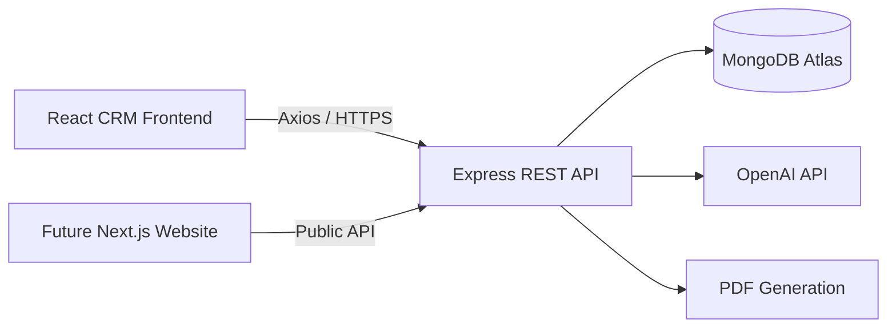

<div align="center">

# 🌴 Dream Ceylon CRM

### A modern MERN-stack CRM for Sri Lankan Destination Management Companies

<p>
  Manage inquiries, customers, quotations, bookings, payments, follow-ups, vehicles, PDFs, AI tools, analytics, and administrator permissions from one platform.
</p>

<p>
  
  
  
  
</p>

<p>
  
  
  
  
  
  
</p>

</div>

---

## ✨ Overview

**Dream Ceylon CRM** is a full-stack travel operations and customer relationship management platform developed for **Dream Ceylon Journeys**, a Sri Lankan Destination Management Company.

It supports the complete customer journey:

```text
Inquiry → Follow-Up → Quotation → Booking → Payment → Reports
```

The system combines operational management, AI-powered productivity tools, branded PDF generation, analytics, role-based access control, and public APIs for a future Next.js tourism website.

---

## 🚀 Key Features

### 👥 Customer and Sales Management

- Capture and manage customer inquiries
- Search, filter, update, and delete inquiries
- Build complete customer profiles
- View inquiry, quotation, booking, and payment history
- Schedule and complete customer follow-ups
- Identify overdue and upcoming follow-ups
- Export business data to CSV

### 🧾 Quotations and Bookings

- Create professional travel quotations
- Generate branded quotation PDFs
- Convert accepted quotations into bookings
- Manage booking details and status
- View bookings in a calendar
- Generate booking invoices and receipts
- Track outstanding balances

### 💳 Payments and Finance

- Record booking payments
- View payment history
- Handle refunds
- Calculate paid, pending, and outstanding amounts
- Generate individual payment receipts
- View financial reports
- Export report data

### 🤖 AI Tools

- Generate client replies
- Generate travel itineraries
- Create professional itinerary content
- Improve response quality and speed
- Support configurable OpenAI models

### 🚐 DMC Operations

- Manage destinations
- Manage tour packages
- Manage vehicles
- Configure company information
- Configure PDF branding and payment instructions
- Connect the CRM with a future public website

### 📊 Analytics and Monitoring

- Dashboard statistics
- Revenue and booking charts
- Recent activity panel
- Follow-up alerts
- Searchable activity logs
- Administrator action tracking

### 🔐 Security and Administration

- JWT authentication
- Password hashing with bcrypt
- Backend permission enforcement
- Frontend route and action guards
- Administrator account activation
- Custom permissions
- Login rate limiting
- Public inquiry rate limiting
- Helmet security headers
- Configurable production CORS
- Environment validation
- Safe production error handling

---

## 🛡️ Administrator Roles

| Role | Main Access |
|---|---|
| 👑 **Super Admin** | Complete system and administrator control |
| 🧭 **Manager** | Business operations and management |
| 💼 **Sales** | Inquiries, quotations, bookings, and follow-ups |
| 💰 **Finance** | Payments, refunds, and financial reports |
| 👁️ **Viewer** | Read-only operational access |

Custom permissions can be added to individual administrator accounts.

---

## 🧰 Technology Stack

<div align="center">

<table>
<tr>
<td align="center" width="110">
<br/>
<b>Node.js</b>
</td>
<td align="center" width="110">
<br/>
<b>Express</b>
</td>
<td align="center" width="110">
<br/>
<b>MongoDB</b>
</td>
<td align="center" width="110">
<br/>
<b>React</b>
</td>
<td align="center" width="110">
<br/>
<b>Vite</b>
</td>
<td align="center" width="110">
<br/>
<b>Bootstrap</b>
</td>
</tr>
<tr>
<td align="center" width="110">
<br/>
<b>JavaScript</b>
</td>
<td align="center" width="110">
<br/>
<b>Git</b>
</td>
<td align="center" width="110">
<br/>
<b>GitHub</b>
</td>
<td align="center" width="110">
<br/>
<b>Postman</b>
</td>
<td align="center" width="110">
<br/>
<b>HTML5</b>
</td>
<td align="center" width="110">
<br/>
<b>CSS3</b>
</td>
</tr>
</table>

</div>

### Backend

- Node.js
- Express.js
- MongoDB Atlas
- Mongoose
- JSON Web Tokens
- bcryptjs
- OpenAI API
- pdf-lib
- Helmet
- Express Rate Limit
- CORS
- dotenv

### Frontend

- React
- Vite
- React Router DOM
- Axios
- Bootstrap
- React Icons
- Recharts

---

## 🏗️ System Architecture



---

## 📂 Project Structure

```text
dream-ceylon-crm/
│
├── backend/
│   ├── assets/
│   ├── config/
│   ├── controllers/
│   ├── middleware/
│   ├── models/
│   ├── routes/
│   ├── scripts/
│   ├── utils/
│   ├── .env.example
│   ├── package.json
│   └── server.js
│
├── frontend/
│   ├── public/
│   ├── src/
│   │   ├── api/
│   │   ├── components/
│   │   ├── config/
│   │   ├── context/
│   │   ├── layouts/
│   │   └── pages/
│   ├── .env.example
│   └── package.json
│
├── docs/
│   ├── API_DOCUMENTATION.md
│   ├── DEPLOYMENT_GUIDE.md
│   ├── PROJECT_FEATURES.md
│   ├── PRODUCTION_CHECKLIST.md
│   └── SECURITY.md
│
├── postman/
├── README.md
└── SECURITY.md
```

---

## ⚙️ Local Installation

### 1️⃣ Clone the Repository

```bash
git clone YOUR_REPOSITORY_URL
cd dream-ceylon-crm
```

### 2️⃣ Install Backend Dependencies

```bash
cd backend
npm install
```

Create the backend environment file:

```bash
copy .env.example .env
```

Configure:

```env
NODE_ENV=development
PORT=5000

MONGO_URI=your_mongodb_connection_string

JWT_SECRET=your_long_random_jwt_secret
JWT_EXPIRES_IN=30d

OPENAI_API_KEY=your_openai_api_key
OPENAI_MODEL=your_model_name

CLIENT_URL=http://localhost:5173
CLIENT_URLS=http://localhost:5173
```

Start the backend:

```bash
npm run dev
```

### 3️⃣ Install Frontend Dependencies

Open a new terminal:

```bash
cd frontend
npm install
```

Create:

```bash
copy .env.example .env
```

Use:

```env
VITE_API_URL=http://localhost:5000/api
```

Start the frontend:

```bash
npm run dev
```

---

## 🌐 Development URLs

| Service | URL |
|---|---|
| 🖥️ Frontend | `http://localhost:5173` |
| ⚙️ Backend API | `http://localhost:5000` |
| ❤️ Health Check | `http://localhost:5000/api/health` |
| 🔓 Public API | `http://localhost:5000/api/public` |

---

## ❤️ API Health Check

```http
GET /api/health
```

Example response:

```json
{
  "status": "ok",
  "service": "Dream Ceylon CRM",
  "version": "1.0.0",
  "environment": "development",
  "database": "connected"
}
```

---

## 🔌 Main API Modules

| Module | Base Route |
|---|---|
| 🔐 Authentication | `/api/auth` |
| 👑 Administrators | `/api/admins` |
| 🗺️ Destinations | `/api/destinations` |
| 🎒 Packages | `/api/packages` |
| 📩 Inquiries | `/api/inquiries` |
| 📅 Bookings | `/api/bookings` |
| 🧾 Quotations | `/api/quotations` |
| 💳 Payments | `/api/booking-payments` |
| 📄 Payment Receipts | `/api/payment-receipts` |
| 📌 Follow-Ups | `/api/follow-ups` |
| 👥 Customers | `/api/customers` |
| 🚐 Vehicles | `/api/vehicles` |
| 💰 Finance | `/api/finance` |
| ⚙️ Settings | `/api/settings` |
| 🧠 AI Tools | `/api/ai` |
| 📑 PDF Tools | `/api/pdf` |
| 📜 Activity Logs | `/api/activity-logs` |
| 🌍 Public Website API | `/api/public` |

---

## 🌍 Public Website API

The CRM is ready to connect with a future Next.js tourism website.

```http
GET  /api/public/home
GET  /api/public/destinations
GET  /api/public/destinations/:id
GET  /api/public/packages
GET  /api/public/packages/:id
GET  /api/public/vehicles
POST /api/public/inquiries
```

The public inquiry endpoint includes rate limiting. CAPTCHA protection should be added when the website is deployed.

---

## 🧪 Testing

The project includes a complete Postman test collection covering:

- Authentication
- Public API access
- Super Admin permissions
- Manager restrictions
- Sales restrictions
- Finance permissions
- Viewer restrictions
- Protected backend routes

### Final Test Result

```text
✅ Passed: 39
❌ Failed: 0
⚠️ Errors: 0
```

---

## 🔒 Security Highlights

- ✅ Public administrator registration disabled
- ✅ Passwords hashed with bcrypt
- ✅ JWT authentication
- ✅ Role-based permissions
- ✅ Custom administrator permissions
- ✅ Frontend route protection
- ✅ Backend API authorization
- ✅ Helmet headers
- ✅ Login rate limiting
- ✅ Public inquiry rate limiting
- ✅ Production CORS allowlist
- ✅ Safe error responses
- ✅ Environment validation
- ✅ Activity auditing

> [!IMPORTANT]
> Never commit `.env`, database credentials, API keys, real passwords, customer exports, or database backups.

---


## 🛣️ Roadmap

- [x] Authentication
- [x] Destination management
- [x] Package management
- [x] Inquiry management
- [x] Customer profiles
- [x] Quotations
- [x] Booking management
- [x] Payment management
- [x] Follow-ups
- [x] PDF documents
- [x] AI tools
- [x] Dashboard analytics
- [x] Activity logs
- [x] Multi-admin roles
- [x] Permission enforcement
- [x] Production security
- [x] Postman testing
- [ ] Next.js tourism website
- [ ] Website content management
- [ ] Cloud image storage
- [ ] Email notifications
- [ ] Multilingual website content
- [ ] Website analytics

---

## 📚 Documentation

| Document | Description |
|---|---|
| 📘 `docs/API_DOCUMENTATION.md` | API endpoints and usage |
| 🚀 `docs/DEPLOYMENT_GUIDE.md` | Production deployment instructions |
| 🛡️ `docs/SECURITY.md` | Security policy and requirements |
| ✅ `docs/PRODUCTION_CHECKLIST.md` | Final deployment checklist |
| ✨ `docs/PROJECT_FEATURES.md` | Complete feature summary |

---

## 🤝 Contribution

This is a private business project developed for Dream Ceylon Journeys.

For internal development:

```bash
git checkout -b feature/feature-name
git add .
git commit -m "Add feature description"
git push origin feature/feature-name
```

---

## 👨‍💻 Developer

**Janith Dasanayaka**

Software Engineering Student • Full-Stack Developer

---

## 🏢 Project

**Dream Ceylon Journeys**  
Sri Lankan Destination Management Company

---

## 📄 License

This project is currently maintained as private software for Dream Ceylon Journeys.

---

<div align="center">

### 🌴 Dream Ceylon CRM

**Smarter travel operations. Better customer experiences.**

Made with ❤️ in Sri Lanka 🇱🇰

</div>
